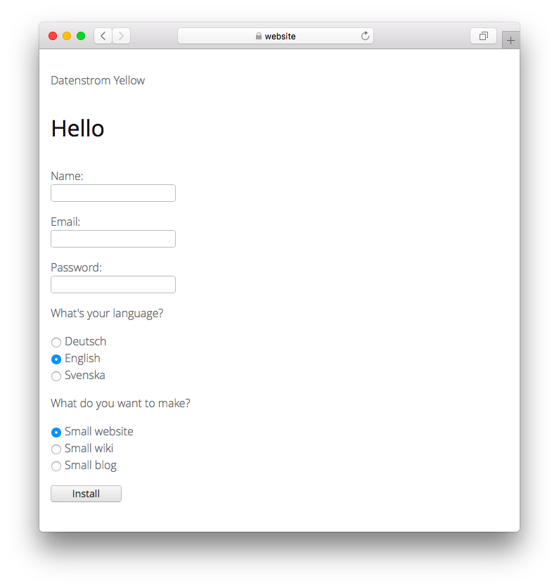

<a href="README-de.md">Deutsch</a> &nbsp; <a href="README.md">English</a> &nbsp; <a href="README-sv.md">Svenska</a>

# Install 0.9.4

Eine brandneue Webseite installieren.

## Wie man eine Webseite installiert

Datenstrom Yellow herunterladen und der Installationsanleitung folgen. Das Installationsprogramm hilft dir beim Einrichten deiner Webseite und stellt sicher dass alle Installationsanforderungen erfüllt sind. Deine Webseite ist sofort erreichbar. Die wichtigsten Dinge sind mit dabei. Natürlich kannst du das später ändern. Es gibt Erweiterungen mit zusätzlichen Funktionen, Sprachen und Themes die du installieren kannst. [Loslegen](https://datenstrom.se/de/yellow/help/how-to-get-started).

## Wie man die Installation überspringt

Du kannst die Installation in der [Befehlszeile](https://github.com/annaesvensson/yellow-core/tree/main/README-de.md) überspringen. Öffne ein Terminalfenster. Gehe ins Installations-Verzeichnis, dort wo sich die Datei `yellow.php` befindet. Gib ein `php yellow.php skip installation` gefolgt von einer Option. Die Option `small` installiert nur die wichtigsten Dinge für kleine Webseiten, das ist dasselbe wie die Standardinstallation mit der englischen Sprache. Die Option `medium` installiert auch die Hilfeerweiterung mit der Dokumentation. Die Option `large` installiert alle verfügbaren Erweiterungen.

## Beispiele

Installation in der Befehlszeile überspringen:

`php yellow.php skip installation`  

Installation in der Befehlszeile überspringen, verschiedene Optionen:

`php yellow.php skip installation small`  
`php yellow.php skip installation medium`  
`php yellow.php skip installation large`  

## Einstellungen

Die folgenden Dateien werden bei der Installation geändert:

`system/extensions/yellow-system.ini` = Datei mit Systemeinstellungen  
`system/extensions/yellow-language.ini` = Datei mit Spracheinstellungen  
`system/extensions/yellow-user.ini` = Datei mit Benutzereinstellungen  
`system/extensions/yellow-extension.ini` = Datei mit Erweiterungseinstellungen  
`system/extensions/yellow-website.log` = Logdatei der Webseite  

Die folgenden Dateien werden bei der Installation angepasst:

`content/1-home/page.md` = Inhaltsdatei für die Startseite  
`content/9-about/page.md` = Inhaltsdatei für die Informationsseite  
`content/shared/page-new-default.md` = Inhaltsdatei für neue Seite  
`content/shared/page-new-wiki.md` = Inhaltsdatei für neue Wikiseite, [falls Wiki ausgewählt wurde](https://github.com/annaesvensson/yellow-wiki/tree/main/README-de.md)  
`content/shared/page-new-blog.md` = Inhaltsdatei für neue Blogseite, [falls Blog ausgewählt wurde](https://github.com/annaesvensson/yellow-blog/tree/main/README-de.md)  
`content/shared/page-error-404.md` = Inhaltsdatei für Fehlerseite  

## Danksagung

Diese Erweiterung enthält [Übersetzungen](https://github.com/annaesvensson/yellow-language/tree/main/README-de.md) von verschiedenen Mitwirkenden. Danke für die gute Arbeit.

## Entwickler

Anna Svensson. [Hilfe finden](https://datenstrom.se/de/yellow/help/).
